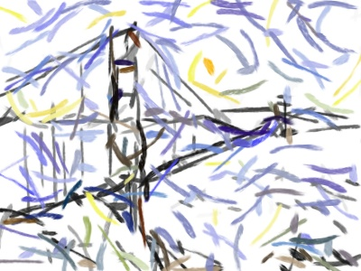
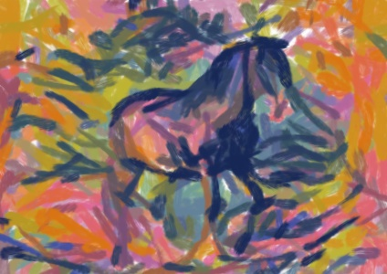

# Painterly-Style-Transfer

This is the code for the paper

**[Painterly Style Transfer with Learned Brush Strokes](https://ieeexplore.ieee.org/document/10319299)**

Accepted by IEEE Transactions on Visualization and Computer Graphics

If you find this code useful for your research, please cite

```
@ARTICLE{liu2023PainterlyST,
	author={Liu, Xiao-Chang and Wu, Yu-Chen and Hall, Peter},
	journal={IEEE Transactions on Visualization and Computer Graphics},
	title={Painterly Style Transfer with Learned Brush Strokes},
	year={2023},
	doi={10.1109/TVCG.2023.3332950}
}
```

## Preresquisites

pip3 install --r requirements.txt

## Running on test images

#### Paint with initial brush strokes as the base canvas:
```bash
python3 plan.py \
  --objective_data nst_pixel/bridge_nst.png \
  --objective clip_conv_loss \
  --objective_weight 1.0 \
  --optim_iter 400 \
  --stroke_length 0.3 \
  --stroke_curva 0.1 \
  --max_height 300 \
  --num_strokes 200 \
  --base_canvas bridge_init.jpg \
  --middle_result_name bridge_strokes.jpg
```

If configured correctly, the result will be similar to this:
<p align='left'>
  
</ p>

#### Paint with different types of brush strokes:
```bash
python3 plan.py \
  --objective_data nst_pixel/horse_nst.png \
  --objective clip_conv_loss \
  --objective_weight 1.0 \
  --optim_iter 400 \
  --stroke_length 0.4 \
  --stroke_curva 0.2 \
  --max_height 300 \
  --num_strokes 1000 \
  --middle_result_name horse_strokes.jpg
```

If configured correctly, the result will be similar to this:
<p align='left'>
  
</ p>

## Running on new images

For ease of running on new content/style image pairs, the following steps are recommended:

1. Get the pixel-based style transfer result. Recommend using the implementation of neural style transfer by Justin Johnson [[code](https://github.com/jcjohnson/neural-style)].

2. Run **plan.py** by setting **--objective_date** as the style transfer result from Step1, and adjust the stroke attributes (**--stroke_length, --stroke_curva, --num_strokes**) to get the painterly style transfer result.

## Acknowledgement
This project is inspired by many existing methods and their open-source implementations, including:

